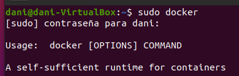
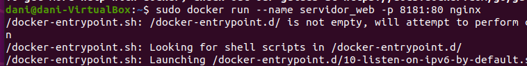
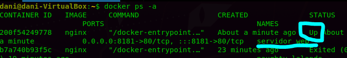
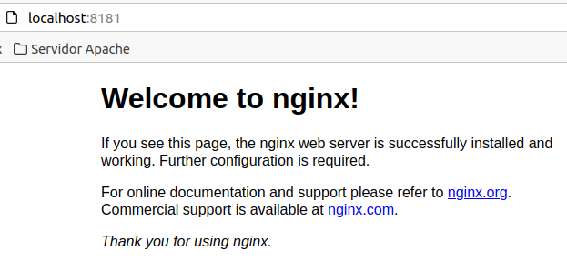
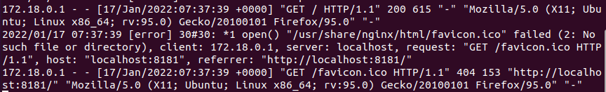
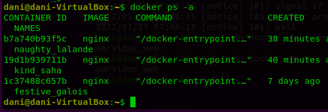

# Ejercicio 1 - Inicial

> Daniel Díaz González - 2022

[TOC]

Arranco docker

```bash
sudo docker
```

Creo el primer daemon a partir de la imagen nginx:

```bash
sudo docker run --name servidor_web -d -p 8181:80 nginx
```





Desde otra terminal compruebo que está correcto (Status Up)



Compruebo que se está ejecutando correctamente mediante un acceso a `localhost:8181` desde el navegador



Y se registra el acceso:



Paro el contenedor `servidor_web` y compruebo desde otra terminal que se ha detenido correctamente

```bash
sudo docker stop servidor_web
```


Ahora elimino el contenedor `servidor_web` y compruebo que ya no queda rastro de él

```bash
sudo docker rm servidor_web
```

