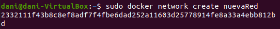

# Ejercicio 2 - Trabajo con imágenes

> Daniel Díaz González - 2022

[TOC]

## 1 - Servidor Web

1. Arranco un contenedor de la imagen `php:7.4-apache` llamado `web` accesible a través del puerto 8000.

```bash
sudo docker run --name web -d -p 8000:80 php:7.4-apache
```


2. Coloco un fichero `index.html` y `mes.php` en en directorio `Documentos` de la máquina virtual y lo vinculo al directorio raíz del servicio web (`/var/www/html`) del contenedor.

```bash
sudo docker run -d -v /home/dani/Documentos:/var/www/html -p 8000:80 --name web php:7.4-apache
```


3. Compruebo el tamaño del contenedor `web`.

```bash
sudo docker system df
```


```bash
sudo docker image ls
```


```bash
sudo docker ps --size
```


## 2 - Servidor de base de datos

1. Creo una red llamada `nuevaRed` y añado el contenedor que instancia `mariadb` en el puerto 3306, creando una base de datos automáticamente al iniciar llamada `prueba`.

```bash
sudo docker network nuevaRed
sudo docker run --detach --network nuevaRed --name bbdd --env MARIADB_USER=invitado --env MARIADB_PASSWORD=invitado --env MARIADB_ROOT_PASSWORD=root  mariadb:latest MARIADB_DATABASE=prueba --port 3306

```




