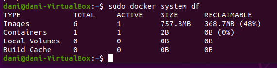
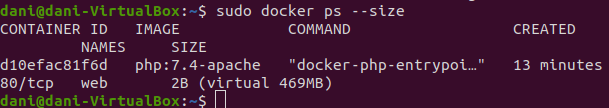
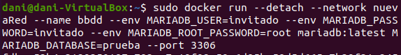

# Ejercicio 2 - Trabajo con imágenes

> Daniel Díaz González - 2022

[TOC]

## 1 - Servidor Web

1. Arranco un contenedor de la imagen `php:7.4-apache` llamado `web` accesible a través del puerto 8000.

```bash
sudo docker run --name web -d -p 8000:80 php:7.4-apache
```


2. Coloco un fichero `index.html` y `mes.php` en en directorio `Documentos` de la máquina virtual y lo vinculo al directorio raíz del servicio web (`/var/www/html`) del contenedor.

```bash
sudo docker run -d -v /home/dani/Documentos:/var/www/html -p 8000:80 --name web php:7.4-apache
```


3. Compruebo el tamaño del contenedor `web`.

```bash
sudo docker system df
```




```bash
sudo docker image ls
```


```bash
sudo docker ps --size
```




## 2 - Servidor de base de datos

1. Creo una red llamada nuevaRed y añado el contenedor que instancia mariadb en el puerto 3306, creando una base de datos automáticamente al iniciar llamada prueba.

```bash
sudo docker network nuevaRed
sudo docker run --detach --name bbdd --env MARIADB_USER=invitado
--env MARIADB_PASSWORD=invitado --env MARIADB_ROOT_PASSWORD=root MARIADB_DATABASE=prueba --port 3336:3306 mariadb:latest
```





2. Hago una instancia de un cliente de base de datos (phpMyAdmin) y conecto para comprobar el acceso al servidor de base de datos con el usuario creado (invitado) y que se ha creado la base de datos `prueba`.

```bash
sudo docker run --name myadmin -d -e PMA_ARBITRARY=1 --link bbdd:mariadb -p 8080:80 phpmyadmin
```


Pantallazo donde se comprueba que no se puede borrar la imagen `mariadb` mientras el contenedor `bbdd` está creado.

```bash
sudo docker images -a
sudo docker rmi mariadb
sudo docker images -a
```


