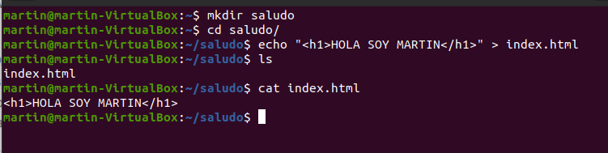
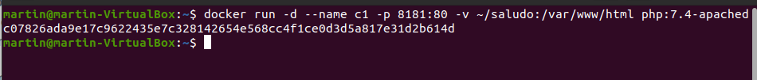
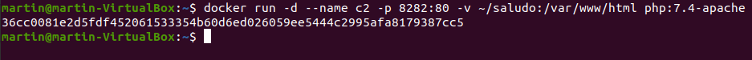
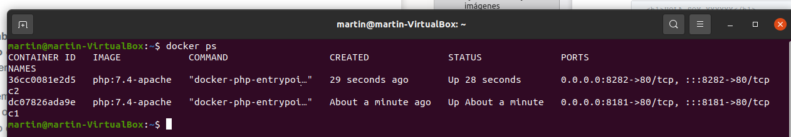
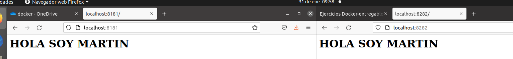
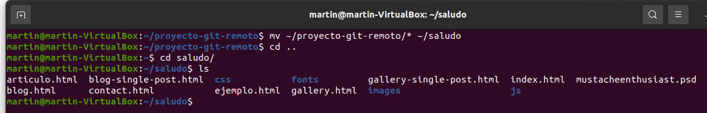
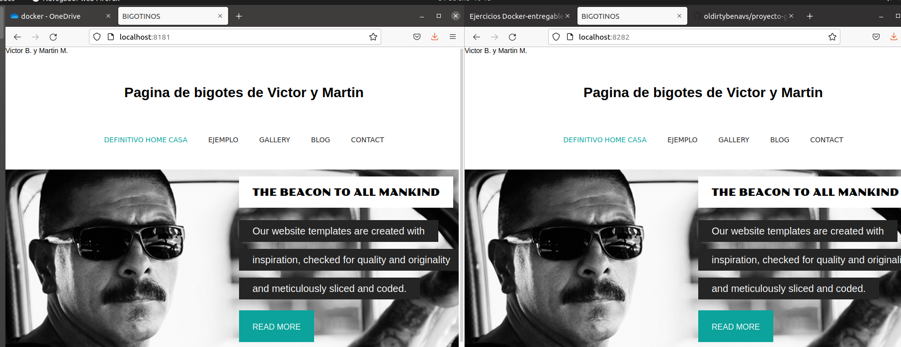
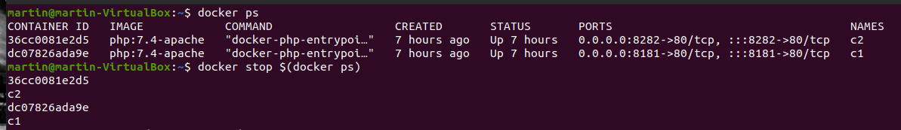
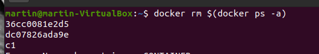
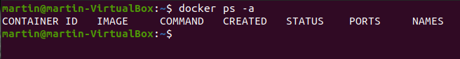

# Ejercicio 3 - Almacenamiento

> Realizado por: MartinLB

[TOC]

## Bind mount para compartir datos

1. Crea una carpeta llamada `saludo` y dentro de ella crea un fichero llamado `index.html` con el siguiente contenido:

   ```html
   <h1>HOLA SOY XXXXXX</h1>
   ```

   ```bash
   mkdir saludo
   cd saludo/
   echo "<h1>HOLA SOY MARTIN</h1>" > index.html
   ```

   


2. Una vez hecho esto arrancar dos contenedores basados en la imagen php:7.4- apache que hagan un bind mount de la carpeta `saludo` en la carpeta `/var/www/html` del contenedor. Uno de ellos vamos a acceder con el puerto 8181 y el otro con el 8282. Y su nombres serán `c1` y `c2` .

   ```bash
   docker run -d --name c1 -p 8181:80 -v ~/saludo:var/www/html php:7.4-apache
   ```

   

   ```bash
   docker run -d --name c2 -p 8282:80 -v ~/saludo:var/www/html php:7.4-apache
   ```

   

   

   

   **Resultado:**

   


3.  Modifica el contenido del fichero `~/saludo/index.html`.

   ```bash
   mv ~/proyecto-git-remoto/* ~/saludo
   ```

   


4. Comprueba que puedes seguir accediendo a los contenedores, sin necesidad de reiniciarlos.

   


5. Borra los contenedores utilizados.

   

   

