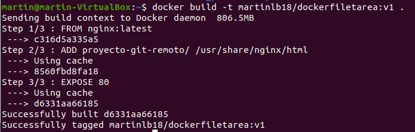

# Ejercicio 5 - Crea una imagen con Dockerfile

> Realizado por: MartinLB

[TOC]

## Crear una imagen con un servidor web que sirva un sitio web

1. Basar la imagen en `nginx` o `apache`.

   ```dockerfile
   FROM nginx:latest
   ADD proyecto-git-remoto/ /usr/share/nginx/html
   EXPOSE 80
   ```

   

   

2. Desplegar una plantilla, o un trabajo de clase, que tenga, al menos, un `index.html` y una carpeta para estilos, imágenes, etc.

   ```bash
   docker build -t martinlb18/dockerfiletarea:v1 .
   ```

   


3. Subir la imagen a DockerHub.

   ```bash
   docker login
   ```

   

   

   ```bash
   docker push martinlb18/dockerfiletarea:v1
   ```

   

   

   


4. Bajada de la imagen por otra persona del grupo.


```bash
docker pull martinlb18/dockerfiletarea
```


5. Creación de contenedor y acceso al navegador del sitio.

   ```bash
   sudo docker run -d -p 80:80 martinlb18/dockerfiletarea:v1
   ```


