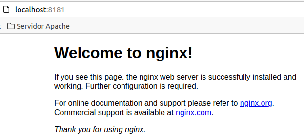

# Tema 5: Docker

> Daniel Díaz González - 2022

[TOC]


## 1 - Ejercicio inicial

Arranco docker

```bash
sudo docker
```

Creo el primer daemon a partir de la imagen nginx:

```bash
sudo docker run --name servidor_web -d -p 8181:80 nginx
```


Desde otra terminal compruebo que está correcto (Status Up)


Compruebo que se está ejecutando correctamente mediante un acceso a `localhost:8181` desde el navegador



Y se registra el acceso:


Paro el contenedor `servidor_web` y compruebo desde otra terminal que se ha detenido correctamente

```bash
sudo docker stop servidor_web
```


Ahora elimino el contenedor `servidor_web` y compruebo que ya no queda rastro de él

```bash
sudo docker rm servidor_web
```


## 2 - Trabajo con imágenes y Servidor de base de datos

### 2.1 - Trabajo con imágenes

Arranco un contenedor de la imagen `php:7.4-apache` llamado `web` accesible a través del puerto 8000:

```bash
sudo docker run --name web -d -p 8000:80 php:7.4-apache
```


Coloco un fichero `index.html` y `mes.php` en en directorio `Documentos` de la máquina virtual y lo vinculo al directorio raíz del servicio web (`/var/www/html`) del contenedor:

```bash
sudo docker run -d -v /home/dani/Documentos:/var/www/html -p 8000:80 --name web php:7.4-apache
```


Compruebo el tamaño del contenedor `web`

```bash
sudo docker system df
```


```bash
sudo docker image ls
```


```bash
sudo docker ps --size
```


### 2.2 - Servidor de base de datos

Creo una red llamada `nuevaRed` y añado el contenedor que instancia `mariadb` en el puerto 3306, creando una base de datos automáticamente al iniciar llamada `prueba`

```bash
sudo docker network nuevaRed
sudo docker run --detach --network nuevaRed --name bbdd --env MARIADB_USER=invitado --env MARIADB_PASSWORD=invitado --env MARIADB_ROOT_PASSWORD=root  mariadb:latest MARIADB_DATABASE=prueba --port 3306

```


## 3 - Carga de ficheros a GitHub

### 3.1 - Prueba inicial

Creo una carpeta en local e inicio en ella un nuevo repositorio con un fichero de prueba (`prueba.html`)


```bash
git init
```

Tras editar el fichero de prueba, hago un `push` al repositorio creado por mi compañero

```bash
git add .
git status
git commit -m "Primer commit de prueba"
git remote add origin master https://github.com/wnh18389/Despliegue--DOCKER
git remote -v
git push origin master
```


### 3.2- Carga de documentos de la práctica

Añado a mi carpeta de trabajo los documentos que contienen la asignación de tareas y el Typora con los ejercicio inicial y de imágenes y servidor con base de datos:

```bash
git add .
git status
```


Hago el `commit` con todo lo nuevo en mi carpeta de trabajo:

```bash
git commit "Segundo commit con ejercicio 1 y 2 junto con asignacion de tareas"
```


Cargo todos los documentos al Github remoto de mi compañero:

```bash
git remote add origin master https://github.com/wnh18389/Despliegue--DOCKER
git remote -v
git push origin master
```


Comprobación de que todos los archivos cargaron correctamente:


## 4 - Links al hub del grupo y a la infografía utilizada:

**[Github del grupo de clase](https://github.com/wnh18389/Despliegue--DOCKER)**

[Uso de Git pull](https://www.atlassian.com/es/git/tutorials/syncing/git-pull)

[Dockerhub](https://hub.docker.com/_/mariadb)

[Pull request](https://aprendegit.com/que-es-un-pull-request/)


