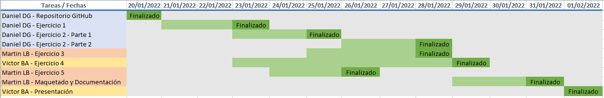

# Asignación de tareas y plazos

> Documentación realizada por: MartinLB

[TOC]

## 1. Miembros del grupo y reparto de tareas

#### Daniel Díaz González

Tareas asignadas:

- Creación y gestión repositorio Git-Hub

- Ejercicio inicial

- Ejercicio 2 - Trabajo con imágenes - Servidor Web

- Ejercicio 2 - Trabajo con imágenes - Servidor de base de datos

  

#### Martin Laviada Brun

Tareas asignadas: 

- Ejercicio 3 - Almacenamiento
- Ejercicio 5 - Crea una imagen con Dockerfile
- Maquetado final y gestión de la documentación

#### Víctor Benavides Alonso-Villaverde

Tareas asignadas: 

- Ejercicio 4 - Redes
- Documento de presentación
- Presentación en clase

## 2. Plazos y evolución

